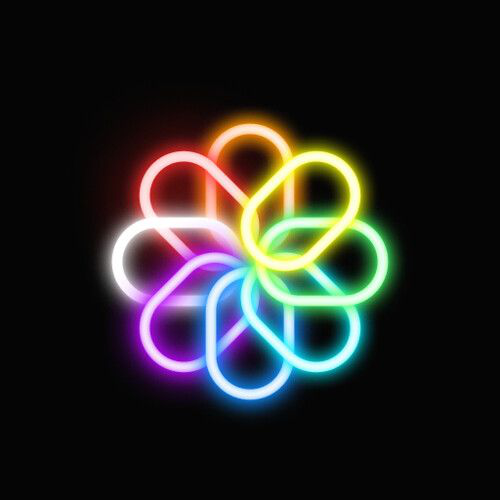

<p align="center">
  
</p>

<h1 align="center">🎨 Click-n-Color</h1>
<h3 align="center">A Smart, Stylish Chrome Extension to Instantly Pick & Save Colors</h3>

<p align="center">
  Your daily dev utility to capture, save, manage, and export color palettes directly from any webpage with ease!
</p>

<p align="center">
  
  
  
  
</p>

---
Demo:

https://github.com/user-attachments/assets/da24b13a-4031-4b3c-a845-18bab8d067b9

---

## ✨ Features

- 🖱️ **Pick colors** from any website with one click.
- 💾 **Save your favorite colors** in an interactive palette.
- 🔁 **Copy values** in RGB, HEX, or HSL formats.
- 📤 **Export your palette** as:
  - JSON
  - CSS Variables
  - PNG Image
- ⚙️ **Customize settings**:
  - Default color format (RGB)
  - Max palette size (50 colors)
  - Auto-copy toggle (Enabled by default)
- 🎨 **Themes**:
  - Light
  - Dark (default)
  - Blue → _Highly recommended by the creator!_

---

## 📂 Project File Structure

```
click-n-color/
├── background.js # Initializes storage on install
├── content.js # Enables color picking functionality
├── popup.html # UI for the extension popup
├── popup.css # Fully themed, responsive styles
├── popup.js # Color logic, event handling
├── manifest.json # Chrome extension configuration (V3)
└── icon.png # Extension logo

```

---

## 🚀 Getting Started

### 🛠️ Installation

1. **Clone this repository** or [download ZIP](https://github.com/nikhilagarwal03/Click-n-Color-Chrome-Extension/archive/refs/heads/main.zip).
2. Open **Google Chrome** and visit: `chrome://extensions/`.
3. Enable **Developer mode** (top-right toggle).
4. Click **Load unpacked**.
5. Select the **project root folder**.
6. ✅ Done! You can now use the extension.

---

## 🧠 How It Works

- Injects a script into the web page to fetch color values from any screen pixel.
- Automatically copies color to clipboard if auto-copy is enabled.
- Saves picked colors using `chrome.storage.local` to persist palette.
- Provides export functionality to reuse your colors across projects.

---

## 💡 Use Cases

- Designing UI components and color themes
- Front-end development workflows
- Color referencing for branding
- Creating custom palettes for CSS

---

## 👤 Author

- Made with 💙 by [**Nikhil Agarwal**](https://github.com/nikhilagarwal03).
- Connect with me on [**Twitter/X**](https://x.com/agarwal030).

---

## 📜 License

This project is licensed under the [MIT License](https://github.com/nikhilagarwal03/Click-n-Color-Chrome-Extension/blob/main/LICENSE).  
Feel free to fork, share, and build upon it!

---

## ⭐ Support

If you found this useful, consider giving a ⭐ on [GitHub](https://github.com/nikhilagarwal03/Click-n-Color-Chrome-Extension)!

---


